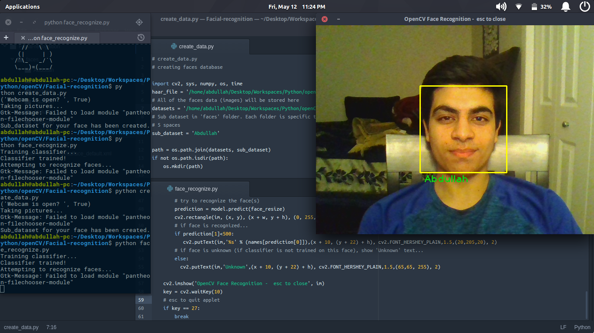

# OpenCV Face Recognition
This OpenCV application can recognize your face, in real-time.

All you have to do is follow these steps:
1. Change the `sub_dataset` variable to the name of the person whose face you're going to store.
2. Run `create_data.py` and wait for it to complete. *Look into the camera and do this in a room with decent lighting.*
3. If everything goes well, you may run `face_recognize.py` and watch it detect and recognize your face!

### Tips:
1. I recommend that you have multiple sub datasets of your face created with different lighting, face angle, etc. You can achieve this by putting spaces after your name in the `create_data.py` file.
2. When you run `face_recognize.py`, look at your camera and sit in the position you did when you created your face's datasets.
3. If you want to increase the chance of your face being recognized, create multiple sub datsets of your face.

### Demo: 
Here's a demo of this application in action:

